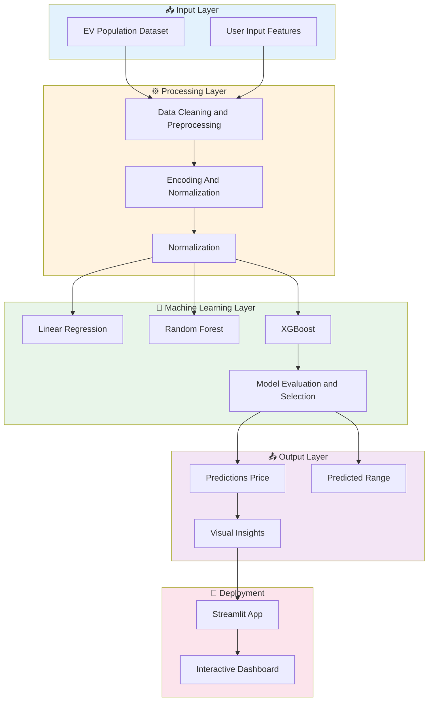
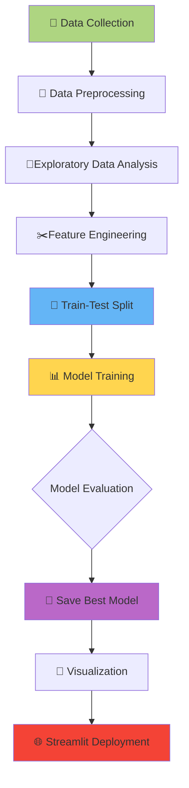

# 🔋Driving the Future: AI Powered Data-Driven Predictor and Visualizer for Electric Vehicle Price and Range 

<div align="center">


**DRIVE SMARTER.PREDICT BETTER.GO ELECTRIC.**

---

### 🎯 Project Impact

```
🌱 Accelerate Green Mobility  |  📊 Enable Fair EV Pricing  |  🚗 Price vs Range Comparison
```

</div>

---

## 🔴 Problem Statement

> **The growing EV market lacks clear and predictive analytics on price and performance of EV.**

### The Challenge

| Current Scenario | The Challenge |
|-----------------|-------------|
| ✅ Rich Ev data available | ❌ No Clear Predictive insights on cost and range |
| ✅ Growing EV adoption | ❌ Hard for consumers to compare performance |
| ✅ Data-Driven Innovation | ❌ Few ML tools analyzing EV market behaviour |

### Our Long Term Goal

Build an **ML-powered system** that can:
- 🎯 Predict the price (Base MSRP)of an EV based on its specs.
- 📈 Estimate its electric range (miles per charge).
- 🔍 Discover relationship between brand ,model ,year and type.
- 💚 Provide actionable insights for consumers, manufacturers and policymakers.

---

## 💡 Solution Overview


### Data Insights

| Insight | Obsevation |
|---------|-------------|
| 🔮 **Price Vs Range** | Higher End Model tend to have longer ranges |
| 📊 **Vehicle type** | BEVS outperform PHEVs in range but cost more |
| ⚡ **Manufacturer** | Tesla, BMW, and Nissan dominate high-range segments|
| 🌳 **Model Year** | Newer models show better battery performance |
| 🌳 **CAFV Eligibility** | Incentivized vehicles often have higher efficiency |

---

## ✨ Features

### 🎯 Core Functionality

- **🔢 Price Prediction**
  - Predict EV's base cost (MSRP) using model, type, and year

- **📊 Range Estimation**
  - Predict vehicle's electric range (miles per charge)
  
- **🎨Data Visualization**
  - Interactive EDA showcasing market and manufacturer trends

- **🌱 Feature Engineering**
  - Extract new insights like Price_per_Mile and Vehicle_Age
  
- **🎯 Streamlit Dashboard**
  - Real-time user interface for model predictions
  
- **🔮Multiple ML Models**
  - Random Forest, XGBoost, and Linear Regression comparisons
    
---

## 🏗️ System Architecture



---

## 🔄 ML Pipeline

### Step-by-Step Workflow



### Sample Prediction Formula

```python
#Example derived feature
Price_per_Mile Base_MSRP / Electric_Range

#Example Model Prediction
predicted_pricerf_model.predict(vehicle_features)
```

---


</div>
